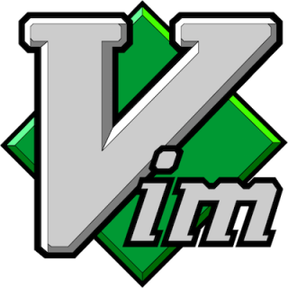
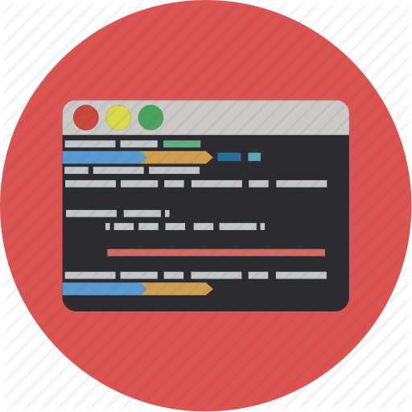
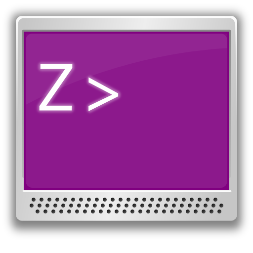

# My Dotfiles Configuration For Linux

1. shell.conf
2. starship.toml
3. tmux.conf
4. init.vim

> ***#Configurations***
  >> ***shell.conf*** - contains shell configuration for linux. It works simultaneously with both bash and zsh shell.
>
  >> ***starship.toml*** - contains the starship prompt configurations.
>
  >> ***tmux.conf*** - tmux configurations for linux and macos
>  
  >> ***init.vim*** - neovim configuration for linux and macos
>
>>***libinput-gestures.conf*** - configuration for multigesture support for mouse support in linux vai xdotool and libinput-tools
